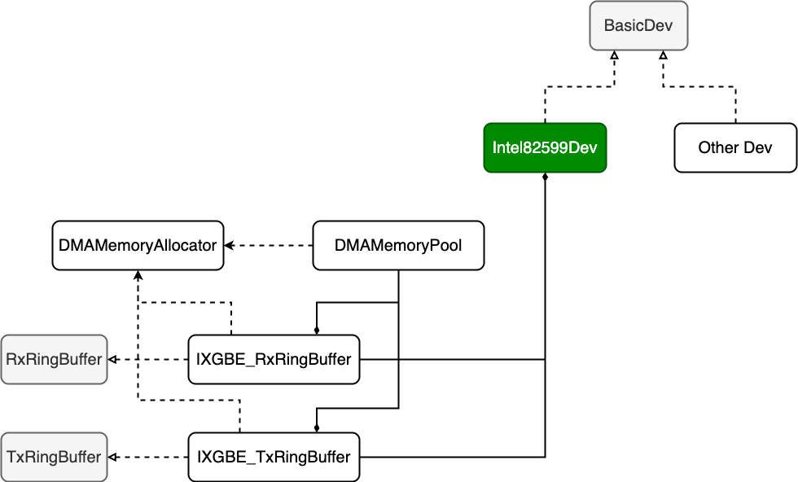
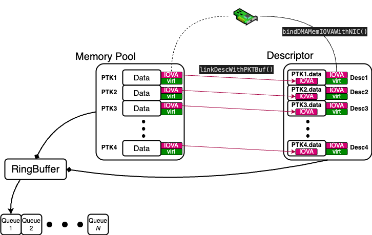

# Introduction
Inspired by https://github.com/emmericp/ixy, which is a simple C-based user space NIC driver, this project is a C++ realization of it.
By rebuilding the project in C++, it is better for beginners to understand the hierarchy and workflow of user-space NIC driver.

Note this program only support Linux.
# Content
This project does not realize all the functions provided in https://github.com/emmericp/ixy yet. It only supports VFIO based NIC. Also, in terms of example applications, only data sending is realized, which is from `ixy-pktgen.c` in `ixy/src/app`
# Features
1. Clearer structure. The **Ring buffer**, **Memory Pool** and the **device** itself are all decoupled.
2. Host and NIC isolation. The manipulations on the host and NIC (the registers) are isolated, which is easy for the reuse of code.
3. Future extension. `BasicDev`, `RxRingBuffer` and `TxRingbufer` are all abstract classes. This makes future extension available.
4. Better Naming. Some functions and variables are renamed for better understanding.
# Hierarchy illustration

1. `BasicDev` is an abstract class. In this project, `Intel82599Dev` is a realization of it in Intel NIC. A new realization can be done in the future. (For example, FPGA-based NIC driver)
2. `DMAMemoryAllocator` is a helper class, which is implemented using singleton pattern. The function is to allocate DMA-enabled memory.
3. `DMAMemoryPool` is a DMA-memory based memory pool.
4. `RxRingBuffer` and `TxRingBuffer` are two abstract classes.
5. `IXGBE_RxRingBuffer` and `IXGBE_TxRingBuffer` are the realization of the two abstract ring buffer classes. Both of them contain `DMAMemoryPool`.
# Ring buffer structure

Here a simplified ring buffer structure is given. When working with devices supporting VFIO, there will always be two types of memory addresses, one is for the outter devices, named IO virtual address (IOVA). The other is the vritual address for the host (shorten as virt here). The allocation of the two memory address is managed by dma_memory_allocator. This figure shows how Memory pool and the descriptors work together in one ring buffer so the outter device can access the data inside the memory pool indirectly.
# How to run
1. First of all, unbind the NIC from the keneral driver. This can be done by running `scripts/setup-vfio.sh`. Just input the PCIe address, separated with space.
2. Enable hugepage in your Linux system. Run `scripts/setup-hugepages.sh` with the number you desire. This script allocate 2-MB hugepages.
3. For compilation, just run `cmake -S . -B build` and then `cmake --build build`
4. For function testing. cd to `build` folder and command `./main`.The default PCIe addresses are `0000:04:00.0` and `0000:05:00.0` while the BAR index is `0`. The program will start two threads, each for one NIC. The two NICs should be connected together. What you expect is that two NICs send data to each other.
For you own PCIe device, check the corresponding PCIe address by using `lspci` in the shell.
# Future work
1. A new driver class for FPGA-based NIC will be added to this project.
2. Multiple queue function is to be realized in the future.
