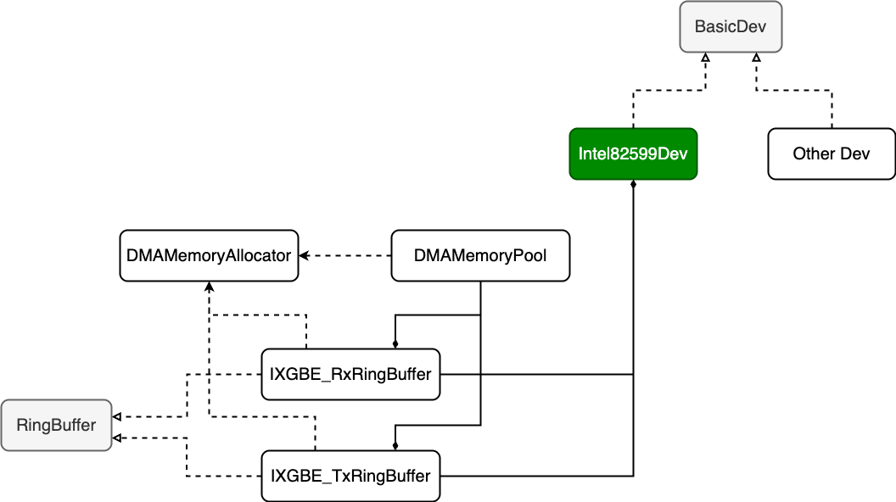
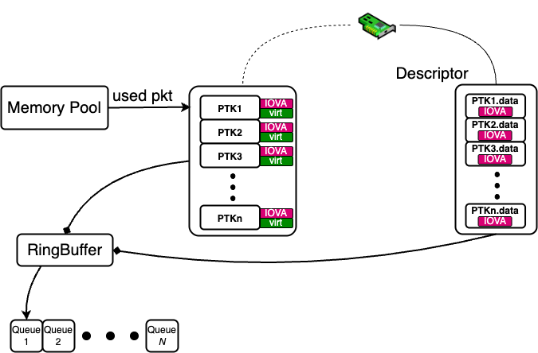
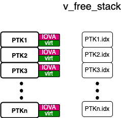

# NIC Driver in C++ (User Space)

Inspired by [ixy](https://github.com/emmericp/ixy), a simple C-based user space NIC driver, this project is a C++ implementation designed for better readability and extensibility.

By rebuilding the project in C++, it becomes easier for beginners to understand the hierarchy and workflow of user-space NIC drivers.

> **Note:** This program only supports Linux.

## Features

1. **Clearer structure** - The **Ring Buffer**, **Memory Pool**, and **Device** are all decoupled into separate classes.
2. **Decoupled ring buffers** - The **packet-buffer ring** and **descriptor ring** are separated. Filling packet buffers is isolated from descriptor ring manipulation.
3. **Host and NIC isolation** - Host-side operations and NIC register manipulations are isolated for better code reuse.
4. **Extensible design** - `BasicDev` and `RingBuffer` are abstract classes, enabling future extensions (e.g., FPGA-based NIC drivers).
5. **Better naming** - Functions and variables are renamed for improved clarity.
6. **TX and RX support** - Both transmit and receive paths are implemented.
7. **Interrupt support** - MSI/MSI-X interrupt support with epoll-based waiting.
8. **Packet capture** - Built-in pcap file capture functionality.

## Hierarchy



| Class | Description |
|-------|-------------|
| `BasicDev` | Abstract base class for NIC devices. `Intel82599Dev` is the concrete implementation for Intel 82599 NICs. |
| `DMAMemoryAllocator` | Singleton helper class for allocating DMA-enabled memory using 2MB huge pages. |
| `DMAMemoryPool` | Memory pool built on DMA memory, managing packet buffers with a free stack. |
| `RingBuffer` | Abstract base class for ring buffers. |
| `IXGBE_RxRingBuffer` | RX ring buffer implementation for Intel 82599. |
| `IXGBE_TxRingBuffer` | TX ring buffer implementation for Intel 82599. |

## Ring Buffer Structure



When working with VFIO devices, there are two types of memory addresses:
- **IOVA (IO Virtual Address)** - Address visible to the NIC for DMA operations
- **Virtual Address (virt)** - Address visible to the host CPU

The `DMAMemoryAllocator` manages both address spaces. The figure above shows how the memory pool and descriptors work together, allowing the NIC to access packet data indirectly through descriptors.

## Data Flow: NIC ↔ Host

Data transfer between the NIC and host occurs through a **two-step IOVA addressing mechanism**:

### Step 1: Descriptor Ring IOVA
The NIC's DMA engine is configured with the **IOVA of the descriptor ring** itself. The driver writes this base address to specific NIC registers during initialization. This tells the NIC where to find the descriptor ring in memory.

### Step 2: Packet Buffer IOVA (Linked via Descriptors)
Each descriptor in the ring contains the **IOVA of a packet buffer**. The NIC reads these IOVAs from the descriptors to know where to DMA the actual packet data.

### RX Path (NIC → Host)
1. Driver allocates packet buffers from the memory pool
2. Driver writes packet buffer IOVAs into RX descriptors
3. Driver writes the descriptor ring's IOVA to NIC registers (RDT - RX Descriptor Tail)
4. NIC reads descriptors from the ring using the descriptor ring IOVA
5. NIC extracts packet buffer IOVAs from each descriptor
6. NIC DMAs received packets directly into packet buffers using their IOVAs
7. NIC marks descriptors as "done" (DD bit set)
8. Driver reads completed descriptors and retrieves packet data from buffers

### TX Path (Host → NIC)
1. Driver fills packet buffers with data to transmit
2. Driver writes packet buffer IOVAs into TX descriptors
3. Driver updates the descriptor ring tail pointer (TDT register)
4. NIC reads descriptors from the ring using the descriptor ring IOVA
5. NIC extracts packet buffer IOVAs from each descriptor
6. NIC DMAs packet data from buffers using their IOVAs and transmits
7. NIC marks descriptors as "done" (DD bit set)
8. Driver cleans completed descriptors and returns buffers to the memory pool

**Key Insight:** The NIC never directly accesses host virtual addresses. All DMA operations use IOVAs, with a two-level indirection: ring IOVA → descriptor → packet buffer IOVA.

### Free Stack



The memory pool uses a **free stack** to track available packet buffers. When a buffer is needed, it's popped from the stack. When released, it's pushed back.

## TX Path - Important Functions

### 1. `fillPktBuf()`

Fills data into free packet buffers from the memory pool. A "used buffer queue" tracks buffers containing data to be transmitted.

.png)

### 2. `linkPktWithDesc()`

Links packet buffers (with data) to TX descriptors by writing their IOVA addresses. This prepares the descriptors for the NIC to read.

.png)

### 3. `cleanDescriptorRing()`

Cleans completed TX descriptors and returns their associated packet buffers to the memory pool's free stack.

.png)

## RX Path - Important Functions

### 1. `fillDescRing()`

Allocates packet buffers from the memory pool and links them to RX descriptors. The NIC will DMA received packets into these buffers.

.png)

### 2. `readDescriptors()`

Reads completed RX descriptors to retrieve received packets. Returns pointers to packet buffers containing received data.

### 3. `releasePktBufs()`

Returns processed packet buffers back to the memory pool's free stack.

## Test Applications

### 1. `test_app_loopsend`

Continuously sends packets in a loop. Useful for throughput testing.

```bash
./build/test_app_loopsend
```

### 2. `test_app_pcap`

Captures received packets and saves them to a pcap file (compatible with Wireshark).

```bash
./build/test_app_pcap <output.pcap>
```

## How to Run

### Prerequisites

1. **Unbind NIC from kernel driver**
   ```bash
   sudo ./scripts/setup-vfio.sh <pci_address>
   ```
   Example: `sudo ./scripts/setup-vfio.sh 0000:04:00.0 0000:05:00.0`

2. **Enable huge pages**
   ```bash
   sudo ./scripts/setup-hugepages.sh <number_of_pages>
   ```
   This script allocates 2MB huge pages.

3. **Find your NIC's PCIe address**
   ```bash
   lspci | grep Ethernet
   ```

### Compilation

```bash
cmake -S . -B build
cmake --build build
```

### Running

```bash
# For loopback send test (modify PCIe address in source if needed)
./build/test_app_loopsend

# For packet capture
./build/test_app_pcap capture.pcap
```

**Default configuration:**
- PCIe addresses: `0000:04:00.0` and `0000:05:00.0`
- BAR index: `0`
- Buffer size: 2048 bytes
- Number of buffers: 2048

## Project Structure

```
├── CMakeLists.txt
├── readme.md
├── figures/
│   ├── hierarchy.png
│   ├── simplified_ringbuffer_structure.png
│   ├── free_stack.png
│   ├── fillPktBuf().png
│   ├── linkPKTBufWithDesc().png
│   ├── cleanDescriptorRing().png
│   └── fillDescRing().png
├── scripts/
│   ├── setup-hugepages.sh
│   └── setup-vfio.sh
└── src/
    ├── basic_dev.cpp/h          # Abstract device base class
    ├── basic_ring_buffer.cpp/h  # Abstract ring buffer base class
    ├── dma_memory_allocator.cpp/h # DMA memory allocation (singleton)
    ├── memory_pool.cpp/h        # Packet buffer memory pool
    ├── ixgbe_ring_buffer.cpp/h  # Intel 82599 ring buffer implementation
    ├── ixgbe_type.h             # Intel 82599 register definitions
    ├── vfio_dev.cpp/h           # Intel 82599 device implementation
    ├── factory.cpp/h            # Device factory function
    ├── device.h                 # Helper macros and functions
    ├── log.h                    # Logging utilities
    ├── test_app_loopsend.cpp    # TX throughput test
    └── test_app_pcap.cpp        # Packet capture application
```

## Future Work

1. FPGA-based NIC driver class
2. Multi-queue support
3. Hardware offloading (checksum, TSO)
4. Performance optimizations (prefetching, cache-line alignment)

## Acknowledgments

This work is done to help people new to NIC drivers understand the internals.  Suggestions and corrections are welcome!
